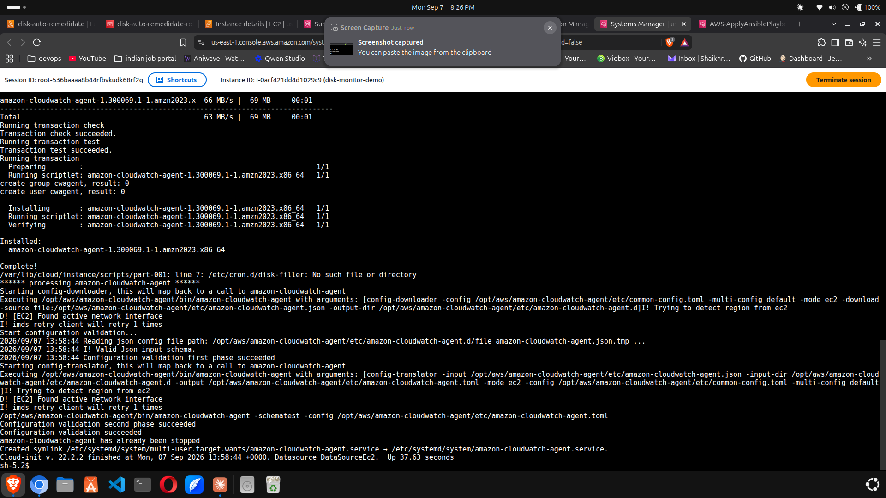
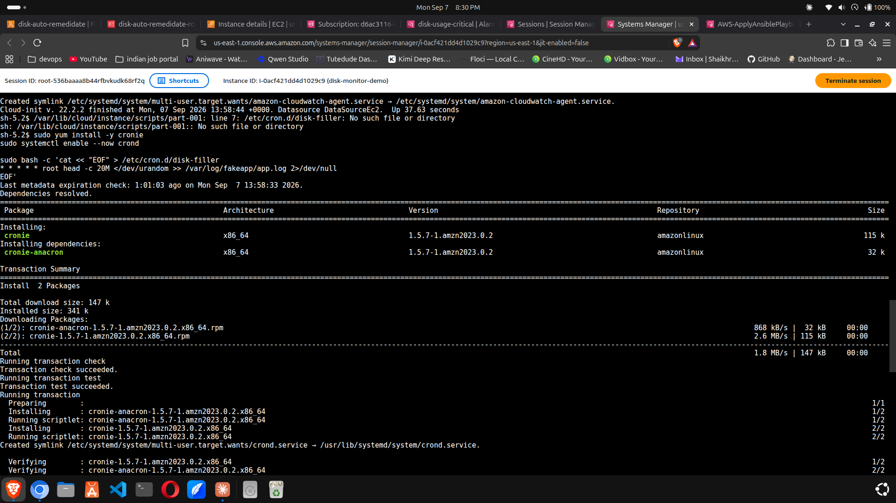
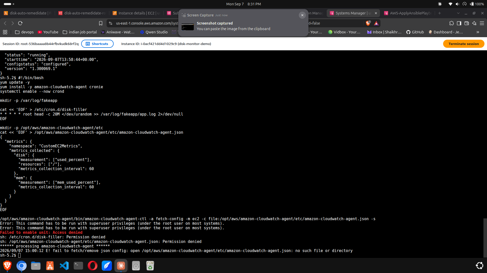
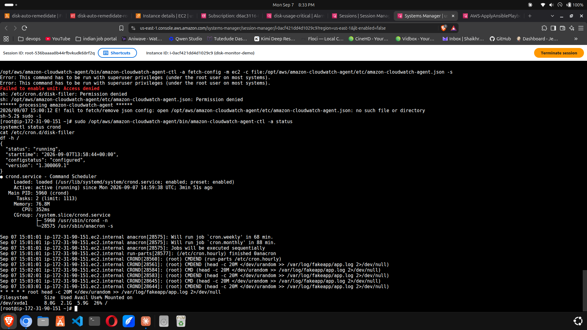

# Project 1: The Disk That Filled Up on a Friday

**Services:** EC2 (Amazon Linux 2023) · CloudWatch Agent · CloudWatch Alarms · SNS · Lambda (Python/boto3) · Systems Manager (Run Command, Session Manager) · IAM

## The Problem

Unmonitored log growth fills a disk and takes an app down, and nobody sees it coming because EC2's default CloudWatch metrics don't cover disk or memory usage at all — that data lives inside the guest OS, and AWS has no visibility into it unless something inside the box reports on itself.

This project builds a pipeline that watches disk usage from the inside, pages a human by email when it crosses a danger threshold, and kicks off an automated fix before anyone even opens their laptop.

## Architecture

```
        writes fake logs
   ┌───────────────────────┐
   │      EC2 Instance      │
   │  (CloudWatch Agent     │
   │   pushing custom       │
   │   disk + mem metrics)  │
   └───────────┬─────────────┘
               │ disk_used_percent
               v
      ┌─────────────────────┐
      │   CloudWatch Alarm   │
      │  (>= 80%, 2 of 2)    │
      └─────────┬────────────┘
                │ ALARM state
                v
        ┌───────────────┐
        │   SNS Topic     │
        └───┬─────────┬───┘
            │         │
   ┌────────v──┐   ┌──v─────────────┐
   │  Email     │   │    Lambda       │
   │ (pages you)│   │ (auto-remediate)│
   └────────────┘   └───────┬─────────┘
                             │ SSM Send Command
                             v
                   ┌───────────────────┐
                   │  Back to the EC2   │
                   │  instance —        │
                   │  truncate log,     │
                   │  free up disk      │
                   └───────────────────┘
```

**Why CloudWatch Agent, not default metrics** — the hypervisor sees CPU and network, not what's happening inside the guest OS's filesystem. Disk and memory usage need an agent running inside the instance.

**Why SNS in the middle instead of wiring the alarm straight to Lambda** — fan-out. One alarm, multiple subscribers. Today it's an email and a Lambda. Adding Slack or PagerDuty later means adding a subscriber, not touching the alarm.

**Why SSM Run Command instead of Lambda SSHing in** — no open port 22, no key pair to manage or leak, authenticated through IAM instead of a static credential sitting on disk somewhere.

**Weakest link** — the Lambda has the instance ID hardcoded. If the instance ever gets replaced (terminated and relaunched, or autoscaled), the Lambda keeps sending commands to an ID that no longer exists and fails silently. Fixing that properly means tagging instances and having the Lambda look targets up dynamically instead of hardcoding — noted as a scaling gap, not solved in this version. See Homework.

## Cost

Free tier eligible end to end for 24 hours: t3.micro under the 750 free hours/month, 8 GiB EBS root volume well under the 30 GiB allowance, 2 custom CloudWatch metrics against a 10-metric free allowance, SNS and Lambda both nowhere near their free thresholds, SSM Run Command free regardless of scale.

Off free tier: t3.micro runs about $0.0116/hr → ~$0.28/day. Everything else on this list rounds to $0.00 at this scale. The only thing that keeps charging if you forget about it is the EC2 instance itself — terminate it when you're done (see Cleanup).

## Build

Full user data script: [`ec2-user-data.sh`](./ec2-user-data.sh)
Lambda code: [`lambda/disk_auto_remediate.py`](./lambda/disk_auto_remediate.py)
IAM inline policy for the Lambda role: [`lambda/ssm_send_command_policy.json`](./lambda/ssm_send_command_policy.json)

Short version of what got built:

1. **IAM role** (`EC2-DiskMonitor-Role`) with `CloudWatchAgentServerPolicy` and `AmazonSSMManagedInstanceCore`, attached to the instance profile.
2. **EC2 instance**, Amazon Linux 2023, t3.micro, no key pair (SSM only, no SSH), the user data script above running at boot.
3. **SNS topic** (`disk-space-alerts`) with two subscriptions: email, and the Lambda function.
4. **Lambda function** (`disk-auto-remediate`), execution role scoped to exactly one permission — `ssm:SendCommand` — nothing else.
5. **CloudWatch Alarm** (`disk-usage-critical`) on `CustomEC2Metrics / disk_used_percent`, threshold >= 80%, 2 out of 2 datapoints to avoid tripping on a single noisy blip.

## What Actually Broke During the Build

This is the part that's more useful than the clean version above. Two real problems hit during the build, both worth knowing before they cost you an hour on a real box.

### 1. Amazon Linux 2023 doesn't ship cron by default

Cloud-init finished, CloudWatch Agent installed clean, and then this showed up in `/var/log/cloud-init-output.log`:

```
/var/lib/cloud/instance/scripts/part-001: line 7: /etc/cron.d/disk-filler: No such file or directory
```

`/etc/cron.d` didn't exist. AL2 always shipped `cronie` (the cron daemon) by default — AL2023 deliberately dropped it, the official line being that systemd timers do the same job. Doesn't matter whether that's a good call, it means any script written against AL2 assumptions about cron silently breaks on AL2023, with zero error at the console level — cloud-init just logs the failure and moves on.



**Fix**, done live over an SSM Session Manager shell since there's no SSH into this box:

```bash
sudo yum install -y cronie
sudo systemctl enable --now crond
```

Then re-wrote the cron.d file, and it wrote fine because the directory that ships with cronie now exists. Also folded the fix back into `ec2-user-data.sh` so a fresh launch from this script won't hit the same wall.



### 2. Pasting a root-context script into a non-root session

After the cronie fix, tried pasting the corrected user-data block straight into the live SSM session to re-run it as a sanity check. Every line failed:

```
Error: This command has to be run with superuser privileges
Failed to enable unit: Access denied
sh: /etc/cron.d/disk-filler: Permission denied
```

Cloud-init runs everything as root automatically at boot — that's the assumption baked into the script. An interactive SSM session logs you in as `ssm-user`, not root, so every privileged line needs `sudo` explicitly or it just bounces. Nothing got corrupted — permission denied means the write never happened, so the working state from the first fix was untouched. Just a wasted paste, not damage.



**Fix** — drop into a root shell first for anything multi-line:

```bash
sudo -i
# paste the block, no per-line sudo needed
exit
```

## Testing & Proof

Confirmed working end to end, not just "should work":

- `systemctl status crond` → active (running), and the syslog tail shows it actually firing on schedule (`CROND[28584]: (root) CMD (head -c 20M ...)`), not just a service sitting enabled and idle.
- `amazon-cloudwatch-agent-ctl -a status` → `"status": "running", "configstatus": "configured"`.
- `df -h /` climbing over time as the cron job writes — captured at 2.1G / 8.0G (26%) partway through the test.
- CloudWatch console showing `disk_used_percent` climbing on the graph under the `CustomEC2Metrics` namespace.
- Alarm crossed the 80% / 2-datapoint threshold and flipped to ALARM state.
- **Email notification received** from the SNS topic — confirms the fan-out actually delivers, not just that the alarm state changed in the console.



To verify the Lambda side actually executed against the instance (not just that it was invoked), check **Systems Manager → Run Command → Command history** for the corresponding command ID and look at the before/after `df -h` output in the result.

## Common Failures

- **No `CustomEC2Metrics` namespace in CloudWatch** — check the IAM role is actually attached to the instance; if it was missing and you just added it, the agent needs a stop/start to pick up new permissions.
- **Instance not showing in Systems Manager Fleet Manager** — missing `AmazonSSMManagedInstanceCore` policy, or no public IP / no path to the SSM endpoints.
- **Cron file exists but nothing fires** — on AL2023, check `cronie` is actually installed and `crond` is active before assuming the syntax is wrong. See above.
- **Commands fail with "superuser privileges" or "Permission denied" in a Session Manager shell** — you're not root in an interactive session the way you are in user data. Use `sudo -i` for anything multi-line instead of prefixing every line.
- **Never got the alarm email** — check SNS → Subscriptions for "Pending confirmation." The confirmation email is separate from the alert email and easy to miss.

## Deep Dive

Still working through these — the goal is to answer in my own words, not paraphrase the writeup:

1. Why don't default EC2 CloudWatch metrics include disk or memory usage? What has to change to get them?
2. Walk through the entire chain from disk crossing 80% to the log file getting truncated. Where's the single point of failure, and what would remove it?
3. Why SSM Run Command instead of Lambda SSHing into the box directly?
4. If auto-remediation succeeds every single time it's triggered, is that actually a win? What's the risk of automating away a symptom instead of the root cause?
5. This is built around one hardcoded instance ID. At 200 instances instead of 1, what breaks, and how would this get redesigned to scale?

## Cleanup

1. Terminate the EC2 instance — confirm the root EBS volume goes with it (check Volumes a minute later for anything orphaned).
2. Delete the CloudWatch alarm (`disk-usage-critical`).
3. Delete the SNS topic (`disk-space-alerts`) — takes both subscriptions with it.
4. Delete the Lambda function (`disk-auto-remediate`).
5. Delete both IAM roles (`EC2-DiskMonitor-Role` and the Lambda's auto-generated execution role).
6. Delete the Lambda's CloudWatch Logs group.

Only step 1 actually bleeds money if skipped — everything else is closer to $0.00 either way, but a clean account is one you can actually reason about later.

## Homework (next step, not done yet)

Right now the Lambda truncates the log every time the alarm fires, forever, with no memory of how many times it's already done that. Extend this with a DynamoDB table tracking remediation count per instance over a rolling 24 hours — if it crosses a threshold, stop auto-fixing and publish to a second SNS topic that pages a human with "auto-remediation gave up, come look at this" instead of quietly cleaning up again. That's the difference between automation and automation with judgment.
